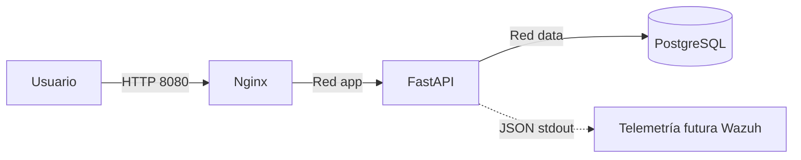

# Implementación 01 — Plataforma base de SanoliFood SA

## Propósito

Este incremento entrega una base ejecutable y verificable para el portal corporativo.
Todavía no implementa procesos de negocio: fija la arquitectura sobre la que crecerán
autenticación y roles, recetas, lotes, calidad, inventario, trazabilidad y auditoría.

## Arquitectura resultante



| Servicio | Publicado en host | Red(es) | Función |
|---|---:|---|---|
| `nginx` | `8080` | `sanoli_dmz`, `sanoli_app` | Entrada, proxy y cabeceras de seguridad |
| `app` | No | `sanoli_app`, `sanoli_data` | Aplicación, API y eventos estructurados |
| `postgres` | No | `sanoli_data` | Persistencia transaccional |

## 1. Comprobación previa

En Ubuntu Server:

```bash
cd ~/sanolifood-soc
git status
docker --version
docker compose version
```

Resultado esperado: rama `main` y árbol de trabajo limpio. Si hay cambios, no continúes
hasta revisarlos o registrarlos en un commit.

## 2. Transferencia desde Windows

Descarga `SanoliFood_Foundation_v0.1.zip`. En PowerShell, sustituye `IP_DE_LA_VM`:

```powershell
scp "$env:USERPROFILE\Downloads\SanoliFood_Foundation_v0.1.zip" socadmin@IP_DE_LA_VM:/home/socadmin/
```

Si usas una carpeta de descargas distinta, modifica únicamente la ruta local.

## 3. Incorporación al repositorio

En Ubuntu Server:

```bash
cd ~/sanolifood-soc
IMPORT_DIR="$(mktemp -d)"
unzip ~/SanoliFood_Foundation_v0.1.zip -d "$IMPORT_DIR"
cp -a "$IMPORT_DIR/SanoliFood_Foundation_v0.1/." .
chmod +x app/entrypoint.sh infrastructure/scripts/healthcheck.sh
```

Verifica que Git detecta los archivos nuevos y modificados:

```bash
git status --short
```

## 4. Configuración segura

```bash
cp .env.example .env
DB_PASSWORD="$(openssl rand -hex 24)"
sed -i "s/CHANGE_ME_WITH_A_LONG_RANDOM_PASSWORD/$DB_PASSWORD/g" .env
unset DB_PASSWORD
git check-ignore .env
```

El último comando debe imprimir `.env`. Si no lo hace, detente: ese archivo contiene
secretos y no debe llegar al repositorio.

## 5. Construcción y arranque

```bash
docker compose config --quiet
docker compose up -d --build
docker compose ps
```

La primera construcción puede tardar varios minutos. El criterio de aceptación es que
`postgres`, `app` y `nginx` aparezcan como `healthy`.

## 6. Validación automática

```bash
make health
make test
curl -sS http://127.0.0.1:8080/health/ready
```

Resultados esperados:

- Tres comprobaciones `OK` y una comprobación HTTP `OK`.
- `3 passed` en las pruebas.
- JSON con `"status":"ready"` y `"database":"reachable"`.

Desde Windows abre `http://IP_DE_LA_VM:8080`. Si la VM utiliza NAT sin acceso directo,
crea una regla de reenvío en VirtualBox desde el puerto `8080` del host al `8080` de la
VM, o utiliza un adaptador de solo-anfitrión.

## 7. Evidencia APP-001

```bash
mkdir -p evidence/APP-001
date --iso-8601=seconds > evidence/APP-001/execution-time.txt
docker compose ps > evidence/APP-001/compose-status.txt
curl -sS http://127.0.0.1:8080/health/ready > evidence/APP-001/health-ready.json
curl -sS -D evidence/APP-001/http-headers.txt -o /dev/null http://127.0.0.1:8080/
set -o pipefail
make test 2>&1 | tee evidence/APP-001/automated-tests.txt
docker compose logs --no-color --tail=200 app > evidence/APP-001/application-json-logs.txt
```

Añade también una captura completa del portal y nómbrala
`evidence/APP-001/dashboard.png`.

## 8. Registro en Git

Antes del commit, confirma que `.env` no aparece en `git status --short`:

```bash
git status --short
git add .
git status --short
git commit -m "Tarea: Implementar plataforma base de SanoliFood SA"
git log --oneline --decorate -2
```

## Criterios de finalización

- Los tres contenedores están saludables.
- Solo Nginx publica un puerto en el host.
- La migración inicial se aplica al arrancar.
- Las pruebas terminan correctamente.
- La interfaz responde desde Windows y es adaptable a móvil.
- Los logs del contenedor `app` son JSON e incluyen `event_type` y `correlation_id`.
- La evidencia `APP-001` existe y el commit deja el árbol limpio.

## Recuperación básica

```bash
docker compose logs --tail=200 postgres app nginx
docker compose restart
make health
```

`docker compose down` detiene el incremento sin borrar los datos. No uses la opción
`-v`, porque elimina el volumen de PostgreSQL.
